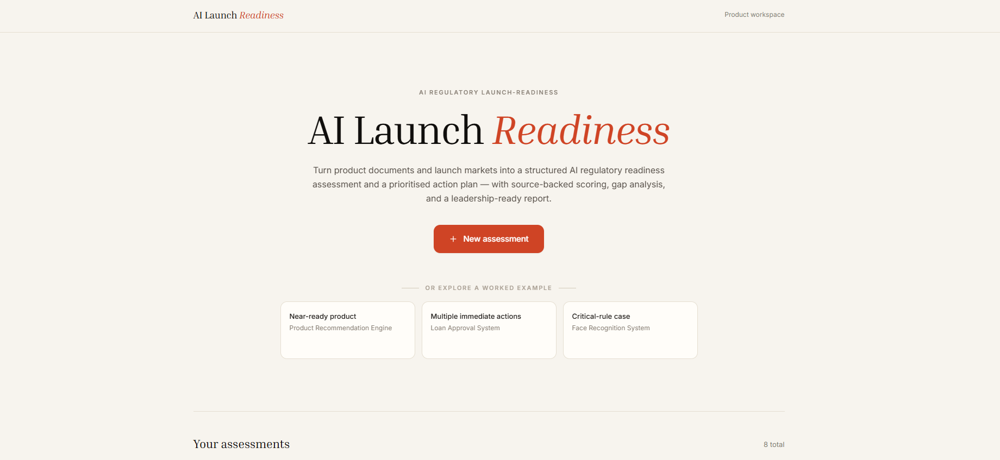
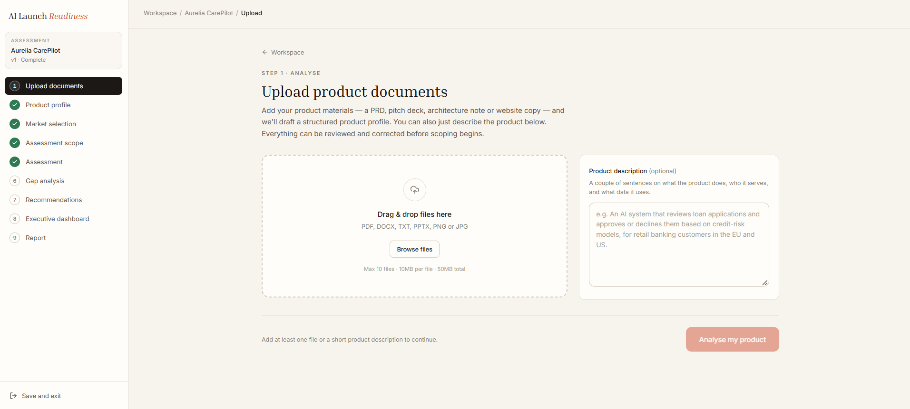
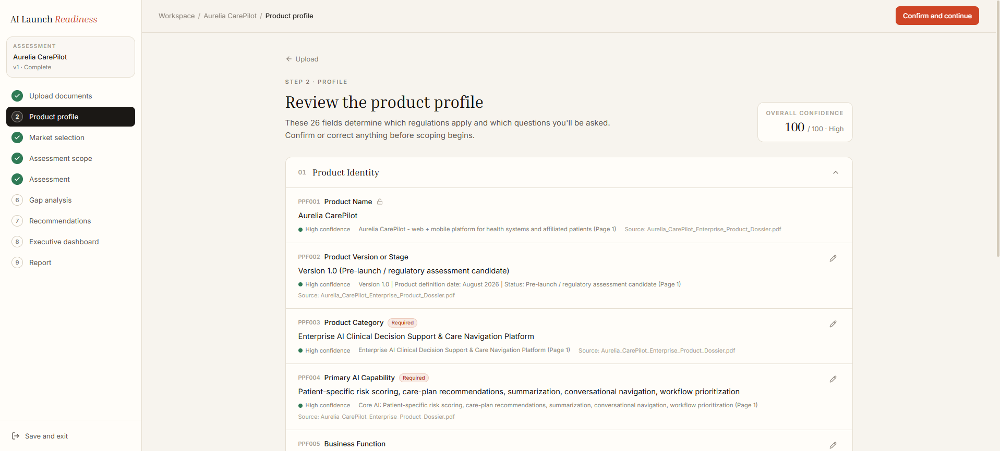
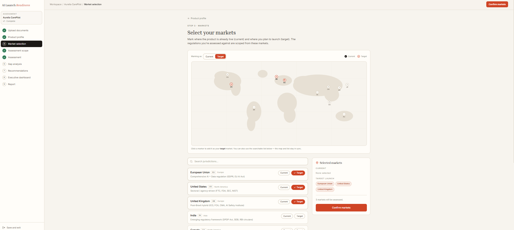
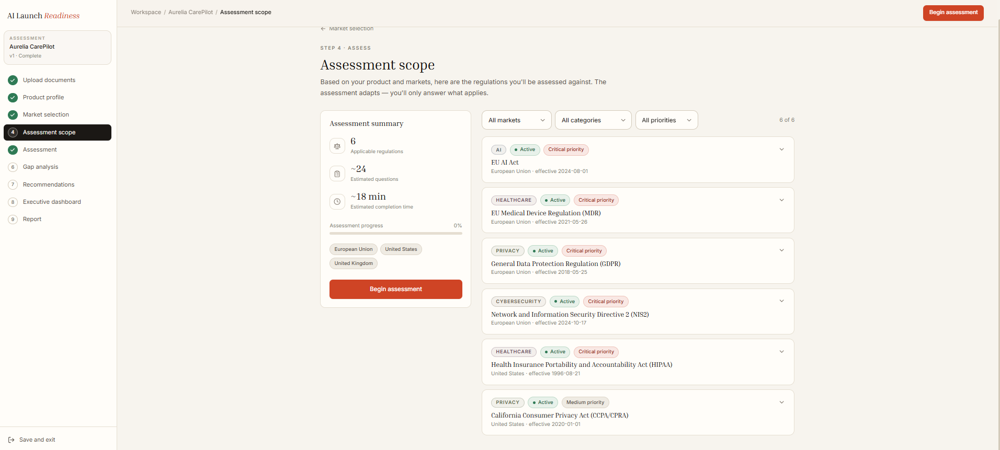
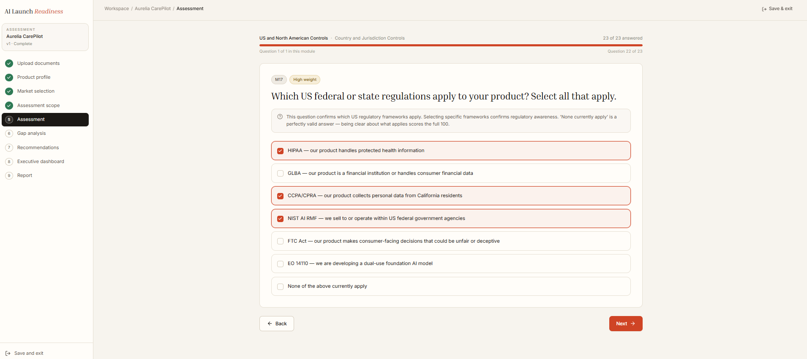
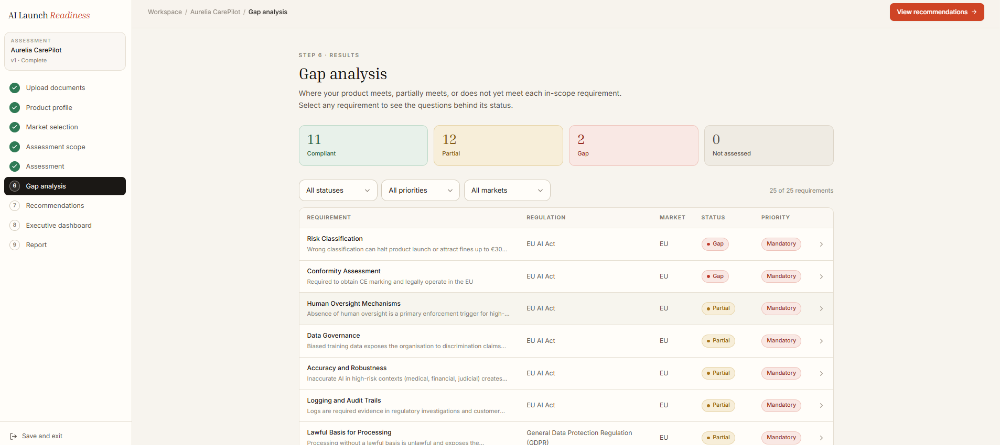
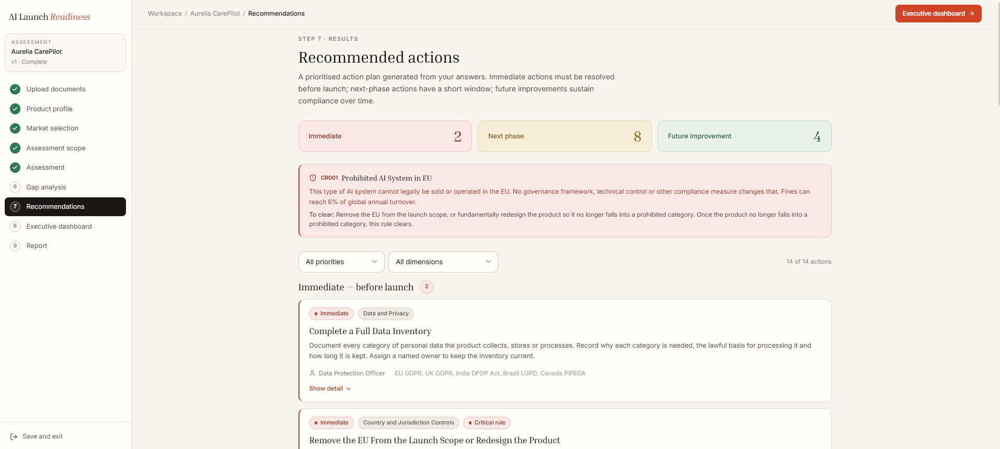
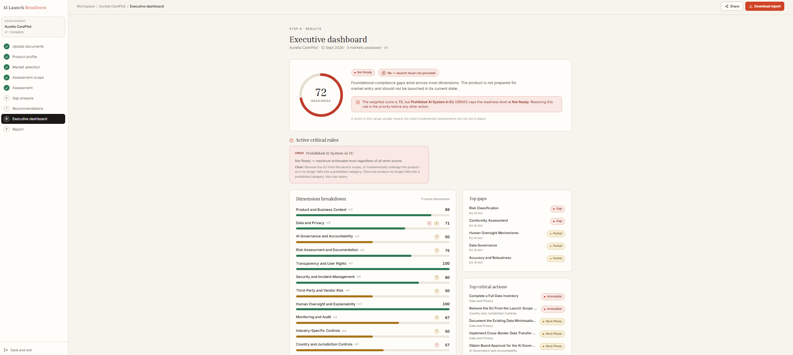
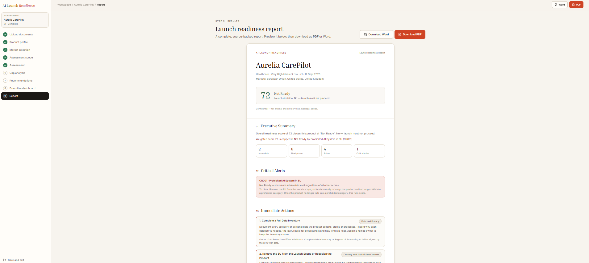

# AI Launch Readiness Platform

A product prototype that helps teams assess whether an AI product is ready to launch across different markets and regulatory requirements.

## What it does

- Builds a Product Profile from product information
- Uses the Gemini API to analyse uploaded product documents and draft the Product Profile
- Selects current and target markets
- Identifies applicable regulations
- Runs an adaptive assessment
- Identifies compliance gaps
- Generates prioritised recommendations
- Produces an executive readiness dashboard and report

## Platform Scale

- 11 jurisdictions
- 34 regulations
- 114 regulatory triggers
- 47 compliance requirements
- 18 assessment modules
- 11 business dimensions
- 26-field Product Profile

## Workflow

Product Information → Product Profile → Market Selection → Regulatory Mapping → Assessment → Gap Analysis → Scoring → Recommendations → Readiness Report

## Live Demo

[Open the live product](https://ai-launch-readiness-platform.vercel.app/)

## Product Walkthrough

### 1. Product Landing

### 2. Upload Product

### 3. Product Profile

### 4. Market Selection

### 5. Assessment

### 6. Questions

### 7. Gap Analysis

### 8. Recommendations

### 9. Executive Dashboard

### 10. Report

## Built With

Next.js • TypeScript • AI workflows • Gemini AOI 
AI-powered product launch readiness assessment platform
